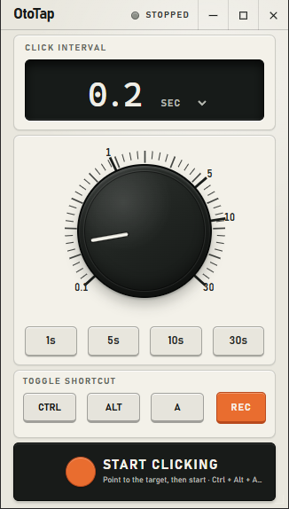

# OtoTap

OtoTap is a compact Windows auto-clicker built with Tauri, React, and Rust.

It lets you set a click interval, start or stop clicking from the app, and toggle clicking with a configurable global shortcut. The app captures the target point when clicking starts, then keeps clicking that point until stopped.



## Features

- Adjustable click interval from 100 ms to 30 seconds
- Seconds and milliseconds input modes
- Preset interval buttons
- Global shortcut toggle
- Tray-friendly window controls
- Native clicking powered by Rust and Tauri

## Requirements

- Windows
- [Bun](https://bun.sh/)
- [Rust](https://www.rust-lang.org/tools/install)
- Tauri system prerequisites

See the [Tauri prerequisites](https://v2.tauri.app/start/prerequisites/) if this is your first Tauri project.

## Development

Install dependencies:

```powershell
bun install
```

Run the desktop app in development:

```powershell
bun run tauri dev
```

Run the frontend only:

```powershell
bun run dev
```

Run tests:

```powershell
bun test
```

Build the app:

```powershell
bun run tauri build
```

## Project Structure

- `src/` - React app
- `src-tauri/` - Tauri and Rust clicker implementation
- `src/interval.ts` - interval parsing and formatting
- `src/types.ts` - shared frontend types

## License

MIT
